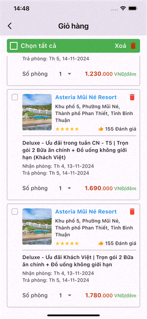

TODO: Manage state without additional package

## Features

<p>Manage state without using additional packages.</p>
<p>Improve performance of application by reducing redundant rendering of other widgets.</p>
<p>By using stream in flutter and InheritedWidget, This package only rebuild widgets registered and do not render whole large widgets, and It does not block the main isolate that causing UI lag, but update UI right after new state coming.</p>

<p>We can get or use the newest state without register by using</p>

```dart
context.persist<CartProvider>().map;
context.persist<CartProvider>().checkAll(false | true);
context.persist<CartProvider>().checkCart(key, false | true)
```

## Usage

```yaml
dependencies:
  flutter:
    sdk: flutter

  carousel_pro:
    git:
      url: https://github.com/williamvux/state_management.git
      ref: main
```

```dart
//Create provider for state
import 'package:state_management/state_management.dart';

 final class CartProvider extends StateBloc {
  final Map<String, bool> map;

  CartProvider({required this.map});

  void checkCart(String key, bool isChecked) {
    map[key] = isChecked;
    notify<CartProvider>();
  }

  void checkAll(bool value) {
    map.updateAll((_, v) => v = value);
    notify<CartProvider>();
  }
}

```

```dart

//Create state provider that map data


final class ShoppingCart extends StatelessWidget {
  static const String routeName = '/shopping-cart';
  static Route route() {
    return MaterialPageRoute(
      builder: (BuildContext context) => BlocProvider(
        create: (context) => CartBloc()..add(const GetItemsCart()),
        child: const ShoppingCart(),
      ),
      settings: const RouteSettings(name: routeName),
    );
  }

  const ShoppingCart({super.key});

  @override
  Widget build(BuildContext context) {
    final label = AppConstants.shared.label;
    return Scaffold(
      appBar: AppBar(
        title: Text(
          label.shoppingCart,
          style: const TextStyle(fontWeight: FontWeight.bold),
        ),
      ),
      body: SafeArea(
        child: StateProvider(
          create: (context) => CartProvider(
            map: mapRoom.map(
                  (key, value) => MapEntry(key, false),
            ),
          ),
          child: Column(
            children: [
              CartHeader(label: label),
              Expanded(
                child: ListCartItems(label: label, rooms: rooms, mapRoom: mapRoom),
              ),
            ],
          ),
        ),
      ),
    );
  }
}


```

```dart
//Register builder for state
final class CartHeader extends StatelessWidget {
  const CartHeader({super.key, required this.label});

  final LanguageLabel label;

  @override
  Widget build(BuildContext context) {
    return Container(
      margin: const EdgeInsets.symmetric(horizontal: 20, vertical: 10),
      decoration: BoxDecoration(
        color: Colors.green,
        borderRadius: BorderRadius.circular(5),
      ),
      child: Row(
        mainAxisAlignment: MainAxisAlignment.spaceBetween,
        children: [
          Row(
            children: [
              Transform.scale(
                scale: 1.25,
                child: StateBuilder<CartProvider>(
                  builder: (_, state) {
                    return Checkbox(
                      checkColor: Colors.white,
                      splashRadius: 8,
                      activeColor: AppConstants.accent,
                      side: const BorderSide(color: Colors.white, width: 2),
                      value: state.map.values.every((value) => value),
                      onChanged: (value) {
                        state.checkAll(value ?? false);
                      },
                    );
                  },
                ),
              ),
            ],
          ),
        ],
      ),
    );
  }
}
```

```dart

//Register builder for state
final class ListCartItems extends StatelessWidget {
  const ListCartItems({super.key, required this.label, required this.rooms, required this.mapRoom});

  final LanguageLabel label;
  final List<RoomRateInfo> rooms;
  final Map<String, InfoCartHotel> mapRoom;

  @override
  Widget build(BuildContext context) {
    return ListView.separated(
      shrinkWrap: true,
      padding: const EdgeInsets.symmetric(horizontal: 20, vertical: 0),
      itemCount: rooms.length,
      separatorBuilder: (_, index) => const SizedBox(height: 10),
      itemBuilder: (_, index) {
        final room = rooms[index];
        return Container(
          key: Key(room.createdAt),
          padding: const EdgeInsets.only(right: 10, bottom: 10),
          decoration: BoxDecoration(
            border: Border.all(color: Colors.grey),
            borderRadius: BorderRadius.circular(5),
          ),
          child: Row(
            crossAxisAlignment: CrossAxisAlignment.start,
            children: [
              StateBuilder<CartProvider>(
                builder: (_, state) {
                  return Checkbox.adaptive(
                    materialTapTargetSize: MaterialTapTargetSize.shrinkWrap,
                    activeColor: AppConstants.accent,
                    value: state.map[room.createdAt],
                    onChanged: (bool? value) {
                      state.checkCart(room.createdAt, value ?? false);
                    },
                  );
                },
              ),
            ],
          ),
        );
      },
    );
  }
}

```

## Result

<div style="width: 150px">

</div>
